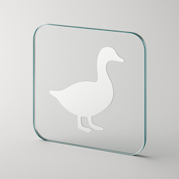

# Goose Glass  

This package creates a few web-pages to migrate a database.
It should work with any database Goose has a provider for (PostgreSQL, SQLite, MySQL...).
**It does not have any authorization or authentication on any endpoints.**
Notice this phrase from the license '...THE SOFTWARE IS PROVIDED "AS IS", WITHOUT WARRANTY OF ANY KIND...'.
It is published as an example of creating a web-page around a third party interface.

See the Go Package documentation for this project to see how you can just pass in a goose.Provider and a handler to get some interactive pages. 