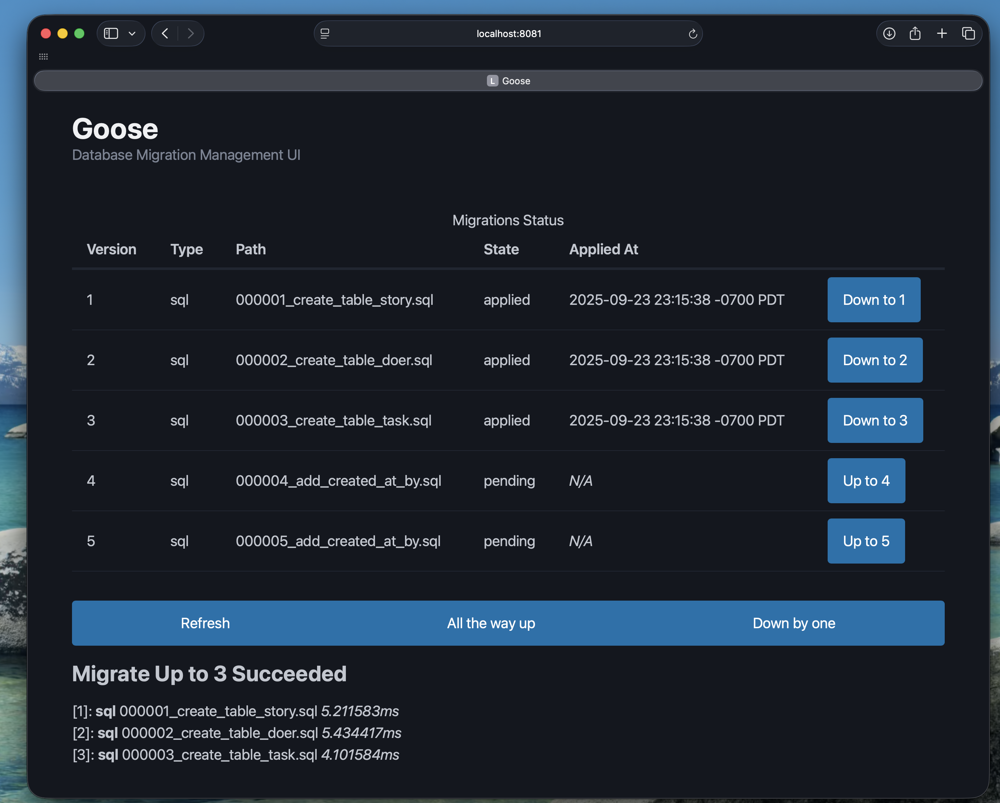

# Goose Glass [](https://pkg.go.dev/github.com/crhntr/gooseglass) 


This package creates a few web-pages to migrate a database.
It should work with any database Goose has a provider for (PostgreSQL, SQLite, MySQL...).
**It does not have any authorization or authentication on any endpoints.**
Notice this phrase from the license '...THE SOFTWARE IS PROVIDED "AS IS", WITHOUT WARRANTY OF ANY KIND...'.
It is published as an example of creating a web-page around a third party interface.

See the Go Package documentation for this project to see how you can just pass in a goose.Provider and a handler to get some interactive pages. 

## Example



```go
package main

import (
	"cmp"
	"database/sql"
	"log"
	"log/slog"
	"net/http"
	"os"

	"github.com/crhntr/gooseglass"
	"github.com/pressly/goose/v3"
	_ "github.com/tursodatabase/libsql-client-go/libsql"
	_ "modernc.org/sqlite"

	"example.com/internal/database"
)

func main() {
	var level = slog.LevelInfo
	if ll, ok := os.LookupEnv("LOG_LEVEL"); ok {
		if err := (&level).UnmarshalText([]byte(ll)); err != nil {
			log.Fatal(err)
		}
		slog.SetDefault(slog.New(slog.NewJSONHandler(os.Stdout, &slog.HandlerOptions{
			Level: level,
		})))
		if level >= slog.LevelDebug {
			goose.SetLogger(slog.NewLogLogger(slog.Default().Handler(), level))
			goose.SetVerbose(level >= slog.LevelDebug)
		}
	}
	log.Println("Starting Migration Server")

	dbURL, ok := os.LookupEnv("DATABASE_URL")
	if !ok {
		log.Fatal("DATABASE_URL environment variable not set")
	}

	db, err := sql.Open("libsql", dbURL)
	if err != nil {
		log.Fatalf("failed to open db %s: %s", dbURL, err)
	}
	defer func() {
		if err = db.Close(); err != nil {
			log.Printf("failed to close db connection %s: %s", dbURL, err)
		}
	}()

	provider, err := database.MigrationsProvider(db)
	if err != nil {
		log.Fatalf("failed to load migrations: %s", err)
	}
	defer func() {
		if err := provider.Close(); err != nil {
			log.Printf("failed to close provider: %s", err)
		}
	}()

	mux := http.NewServeMux()
	gooseglass.Pages(mux, provider)
	port := cmp.Or(os.Getenv("PORT"), "8081")
	log.Printf("serving on port %s", port)
	log.Fatal(http.ListenAndServe(":"+port, mux))
}

```
